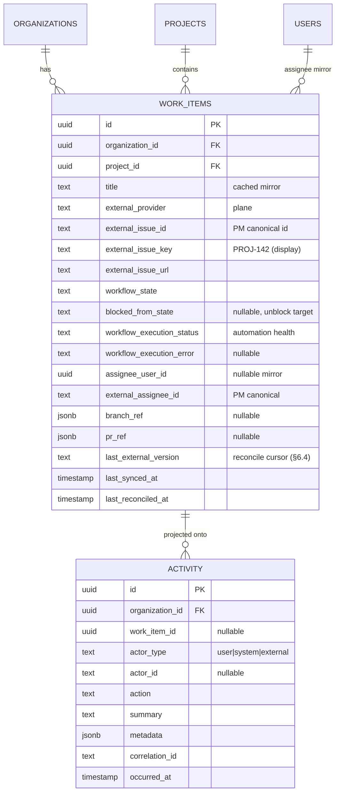

# Wave 3 — Core Domain: architecture & design

**Status:** Approved — frozen for implementation (two review passes; see §16)
**Scope source:** [`phase-1.md`](../../../phase-1.md) §6 · [`project.md`](../../../project.md) §9, §10, §11
**Modules covered:** Work Items (aggregate + state machine), Development Workflow (start-work → branch → PR orchestration through ports), PR/issue reconciliation (inbound webhook consumption), the Activity timeline projection, and a thin Slack notification consumer.

> **Done when** (from `phase-1.md`): starting work on a ticket creates a
> correctly named branch and PR via the GitHub port, the work item advances
> through its state machine, a PR merged outside the platform is reconciled
> (not silently forced), and every step lands on the activity timeline.

This doc is the low-level design for that slice. Read `project.md` §9 first
(external-state-vs-DevFlow-state, the reconciliation model, and the Work
Item aggregate); this is the level below. It also picks up the canonical
domain events that Wave 2 **publishes but does not yet consume** — Wave 3 is
their first consumer.

---

## 1. Scope for this wave

Wave 2 ended at "a normalized canonical event exists in the outbox and is
visible." Wave 3 is what turns those events, plus user actions, into an
orchestrated development workflow with its own state — the first wave that
**calls the outbound port methods** Wave 2's adapters implemented.

In scope:

- `modules/work-items` — the `WorkItem` aggregate (the core domain object),
  its persistence, and its **state machine** (validated transitions +
  reconciliation jumps). Create-and-bind flow against the PM provider.
- `modules/dev-workflow` — orchestrates `startWork → createBranch →
createPullRequest` through `SourceControlPort` via **reliable,
  outbox-driven** job initiation (§4.2), tracking a separate automation
  `workflow_execution_status` (§4.5) distinct from the domain state. Stable
  public interface independent of the execution engine (BullMQ chaining for
  now).
- **Inbound reconciliation** — consuming the Wave 2 canonical events
  (`sourcecontrol.pull_request.*`, `projectmanagement.issue.*`) to reconcile
  external state into DevFlow workflow state, **never overwriting** the
  owning system (`project.md` §9).
- `modules/activity` — a **persisted projection** (`activity` table) built
  from domain events, including out-of-band reconciliation anomalies.
- `modules/notifications` — a thin Slack consumer that posts through
  `ChatPort` on the key workflow events (work started, PR opened, PR
  merged/reconciled). Channel from project config; no preferences/UI this
  wave (§11 review point 11).
- The DevFlow-owned domain events these modules emit
  (`workitem.*`, `devworkflow.*`) and the **route registry** that finally
  wires outbox event types → BullMQ jobs (today only `system.pinged` is
  routed).

Explicitly **out of scope** (flagged, not silently assumed):

| Item                                                                   | Deferred to                             | Why                                                                                                                                                                           |
| ---------------------------------------------------------------------- | --------------------------------------- | ----------------------------------------------------------------------------------------------------------------------------------------------------------------------------- |
| AI ticket generation / acceptance-criteria assist                      | Wave 4 (AI)                             | Work Items exist here so Ticket AI has something to write into; generation itself is a Wave 4 concern. Create-from-external and manual-create prove the aggregate without AI. |
| AI PR review pipeline + `devflow/ai-review` check gating               | Wave 4 (AI)                             | This wave creates the PR and reconciles its state; posting/resolving the AI check is Wave 4. `upsertCheckRun` (the port method) already exists from Wave 2.                   |
| Any UI (dashboard, work-item views, PR review experience, activity UI) | Wave 5 (Frontend)                       | This wave is API-only; endpoints and the activity projection are shaped so the UI is purely additive.                                                                         |
| Durable-execution engine (Temporal/Inngest)                            | Later evaluation (`phase-1.md` §6 note) | The Development Workflow's public interface stays stable regardless; Phase 1 uses BullMQ chaining. Called out so the design doesn't leak engine specifics into callers.       |
| Deployment references on the work item                                 | Phase 3 (`project.md` §9)               | The aggregate reserves the concept but ships no deployment columns.                                                                                                           |
| DevFlow-minted ticket keys / numbering                                 | Later                                   | `projects.key` is reserved but unused; the external issue key (e.g. Plane's `PROJ-142`) is the display key for MVP (§3.3).                                                    |

---

## 2. Domain model



Two new tables: `work_items` and `activity`. Both follow the existing
conventions (`uuid` PK `defaultRandom()`, `organization_id` FK
`onDelete: cascade`, `withTimezone` timestamps, `text` + Zod for enums,
`jsonb().$type<>()` for structured columns).

`work_items` carries **two orthogonal status axes** — `workflow_state` (the
domain lifecycle: BACKLOG…DONE, §3.2) and `workflow_execution_status`
(whether the branch/PR **automation** is idle/running/done/failed, §4.5).
They are deliberately separate: the automation can fail while the domain
state is legitimately `IN_PROGRESS`, and callers must be able to tell those
apart (review point 4).

**Ownership recap (`project.md` §9), made concrete for this wave:**

| Field on `work_items`                                             | Owner               | Rule                                                                                                                                      |
| ----------------------------------------------------------------- | ------------------- | ----------------------------------------------------------------------------------------------------------------------------------------- |
| `title`, `external_issue_*`, `external_assignee_id`               | PM provider (Plane) | Cached mirror; on divergence the PM provider wins, mirror is updated. DevFlow changes these only by writing outbound through the adapter. |
| `branch_ref`, `pr_ref`                                            | GitHub              | Cached reference; GitHub owns the canonical branch/PR details. DevFlow stores only the pointer (repo, name/number, url, last-seen state). |
| `workflow_state`, the relationships themselves, reconcile cursors | **DevFlow**         | Derived from external events **plus** DevFlow policy — never a blind mirror of any one system (`project.md` §9).                          |

---

## 3. Work Items (`modules/work-items`)

### 3.1 The aggregate

`WorkItem` is the core aggregate. It **owns** the orchestration state and
the cross-system relationships; it **does not own** the canonical data
behind its external references (that stays in GitHub / the PM provider).
This is the rule that keeps the database from becoming a second GitHub/Jira
(`project.md` §9).

Every work item **binds to an external PM issue** — there are no
native-only work items in MVP. That gives two creation paths, both ending in
the same bound state:

1. **Create-and-bind** — caller supplies a title/description + `projectId`;
   the service calls `ProjectManagementPort.createIssue(...)` through the
   org's PM connection, then persists a `work_items` row bound to the
   returned external id/key. A connected PM provider is therefore
   **required** to create a work item; without one the endpoint returns a
   `409 integration_required` (§3.4 error table).
2. **Bind-existing** — an inbound `projectmanagement.issue.created` event
   (Wave 2) for an issue not yet tracked creates the bound `work_items` row
   by reconciliation (§6.2), so issues authored directly in Plane still show
   up. This path never calls `createIssue` (the issue already exists).

Both paths converge on the invariant: **one work item per (organization,
external_provider, external_issue_id)**, enforced by a unique constraint
(§9). Reconciliation and create-and-bind race safely on that constraint —
whichever inserts first wins, the other reconciles.

### 3.2 State machine

The state machine is **owned here** (`project.md` §9 defers it to this
module doc). States:

```text
BACKLOG → TODO → IN_PROGRESS → IN_REVIEW → DONE
                     │              │
                     └──► BLOCKED ◄─┘        (from any active state)
   any active state ─────► CANCELLED
```

Transitions come in **two classes**, and keeping them distinct is the whole
point of the machine:

- **Actor-driven transitions** (a user or the workflow engine): guarded,
  only the edges above are legal, an illegal edge is a `409
invalid_transition`. Example: `startWork` requires `TODO → IN_PROGRESS`.
- **Reconciliation jumps** (driven by an inbound external event): these may
  cross edges the actor path forbids, because the external system is
  authoritative for what already happened. Example: a PR merged directly on
  GitHub reconciles `IN_REVIEW → DONE` (or even `IN_PROGRESS → DONE` if the
  platform never saw a review). A reconciliation jump is **never rejected**
  as "invalid" — if it's surprising, it's recorded as an anomaly on the
  activity timeline and still applied within the bounds the owning system
  proves (§6.3), rather than silently forced or silently dropped.

| From        | Actor edge                                  | Reconciliation jump (trigger)                                         |
| ----------- | ------------------------------------------- | --------------------------------------------------------------------- |
| BACKLOG     | → TODO                                      | → CANCELLED (issue closed in PM)                                      |
| TODO        | → IN_PROGRESS (`startWork`)                 | → DONE (PR merged out-of-band); → CANCELLED                           |
| IN_PROGRESS | → IN_REVIEW (PR opened), → BLOCKED          | → DONE (PR merged); PR closed-unmerged → IN_PROGRESS (stay) + anomaly |
| IN_REVIEW   | → DONE, → IN_PROGRESS, → BLOCKED            | → DONE (PR merged); PR reopened → IN_PROGRESS                         |
| BLOCKED     | → unblock (returns to `blocked_from_state`) | → DONE / CANCELLED from owning system                                 |
| DONE        | (terminal for actors)                       | → IN_PROGRESS only via reconciliation (PR reopened) + anomaly         |
| CANCELLED   | (terminal)                                  | —                                                                     |

**Recovering the pre-BLOCKED state.** `work_items` stores
`blocked_from_state` (nullable): entering BLOCKED captures the current
active state there, and unblocking transitions back to it and clears the
column. BLOCKED is modelled as a real `workflow_state` value (matching
`project.md` §9's own example of an item being BLOCKED while its PR is OPEN)
rather than an orthogonal flag, so there is exactly one lifecycle axis;
`blocked_from_state` is the minimal state needed to make BLOCKED reversible
without inventing a second lifecycle (review point 3).

`blocked_from_state` invariants (enforced in the state machine, unit-tested
§14):

- Only an **active** state (`IN_PROGRESS`, `IN_REVIEW` — the states from
  which BLOCKED is reachable) may populate `blocked_from_state`.
- Entering BLOCKED **captures** the current state into `blocked_from_state`.
- A repeated BLOCKED transition while already BLOCKED is a **no-op** for the
  column — it never overwrites the originally captured state.
- Unblocking **restores** `blocked_from_state` and **clears** the column.
- A reconciliation jump to a terminal state (DONE/CANCELLED) from BLOCKED
  also **clears** `blocked_from_state` — the pre-block state is no longer
  meaningful once the item is terminal.

The machine is a pure function `transition(current, event) → next | error`
with the two classes as distinct entry points (`applyActorTransition` vs
`applyReconciliation`), unit-tested exhaustively (§14). Every accepted
transition emits a `workitem.state_changed` domain event carrying
`{ from, to, reason: 'actor' | 'reconciliation', trigger }`.

### 3.3 Keys and display

DevFlow does **not** mint its own ticket numbers in MVP. The PM provider's
issue key (Plane's `PROJ-142`) is stored as `external_issue_key` and is the
display identifier. `projects.key` stays reserved for a future
DevFlow-native numbering scheme; calling it out now avoids a migration later
being mistaken for a behavior change.

### 3.4 Work-item service error paths

| Situation                                          | Outcome                                                                                                    |
| -------------------------------------------------- | ---------------------------------------------------------------------------------------------------------- |
| Create requested, no PM connection for the org     | `409 integration_required` — creation needs an adapter to author the external issue                        |
| Create requested, PM `createIssue` fails           | `502 provider_error`, no `work_items` row persisted (the external issue is the anchor; no anchor → no row) |
| Actor transition not allowed by the machine        | `409 invalid_transition` with `{ from, attempted }`                                                        |
| Action on a work item in another org               | `404` (org-scoped repository can't see it — structural, not a per-handler check, per §12)                  |
| Reconciliation event for an unknown external issue | Not an error — creates the bound row (bind-existing path, §3.1)                                            |

---

## 4. Development Workflow (`modules/dev-workflow`)

Orchestrates the outbound half of the flow: turning "a developer starts
work" into a branch and a PR created through `SourceControlPort`, advancing
the work item as each step lands.

### 4.1 Public interface (engine-independent)

```ts
interface DevelopmentWorkflow {
  startWork(ctx: OrgContext, input: { workItemId: WorkItemId }): Promise<StartWorkResult>;
}
```

`startWork` is the only public entry point for MVP. It is **synchronous at
the API boundary only up to committing** the state change and its outbox
event — the actual branch/PR creation runs as outbox-driven BullMQ jobs so a
slow or flaky GitHub call never blocks the request and every step is
independently retryable/idempotent. The method's signature stays identical
whether the engine is BullMQ chaining (now) or a durable-execution engine
(later) — callers never see job ids or engine types (`phase-1.md` §6 note).

### 4.2 The saga (outbox-driven initiation)

The request handler does **not** enqueue a job directly — that would reopen
the "the state change commits but the enqueue fails" gap the review flagged
(review point 1). Instead it runs **one transaction**: advance
`TODO → IN_PROGRESS`, set `workflow_execution_status = RUNNING`, and write a
`devworkflow.work_started` **outbox event**; then it returns `202`. The
outbox relay — the same claim-lease path Wave 2 proved — routes
`devworkflow.work_started → dev-workflow.create-branch`. State change and
workflow kickoff now share a commit boundary: both survive or neither does.

```mermaid
sequenceDiagram
    participant API as startWork (API)
    participant DB as Postgres (tx)
    participant OB as outbox relay
    participant Q as BullMQ
    participant SC as SourceControlPort
    API->>DB: tx { TODO→IN_PROGRESS; execution=RUNNING; outbox: devworkflow.work_started }
    API-->>API: 202 { workItemId, status: 'starting' }
    OB->>Q: route work_started → create-branch (jobId = create-branch:{workItemId})
    Q->>SC: findOrCreateBranch(named per workflowConfig)
    SC-->>Q: Branch
    Q->>DB: tx { branch_ref active; outbox: devworkflow.branch_created }
    OB->>Q: route branch_created → create-pr (jobId = create-pr:{workItemId})
    Q->>SC: findOrCreatePullRequest(head=branch, base, title per template)
    SC-->>Q: PullRequest
    Q->>DB: tx { pr_ref set; IN_PROGRESS→IN_REVIEW; execution=COMPLETED; outbox: devworkflow.pull_request_opened }
```

**Chaining is outbox-driven too.** Each step's success writes the _next_
step's trigger event in the same transaction that records its result, so
step N+1 is enqueued reliably iff step N's result committed — there is never
a direct enqueue paired with a state mutation. Every job carries a
**deterministic job id keyed by work item**
(`jobId('dev-workflow.create-branch', workItemId)`), so a duplicate trigger
event (at-least-once) collapses to one active job, and a failure creating
the PR never re-creates the branch.

### 4.3 Outbound idempotency & the concurrent-create race (Wave 2 §3.7)

Branch and PR creation are the canonical "provider has no native idempotency
key" case (`project.md` §10, Wave 2 §3.7 tier 2). The guarantee is stated
precisely (review point 2): **retries and concurrent execution converge on
the same single external resource** — not "exactly one create call is ever
issued." Two mechanisms get us there:

1. **Single-flight per work item.** The deterministic `jobId` keyed by work
   item means BullMQ keeps at most one active `create-branch` (and one
   `create-pr`) per work item; duplicate trigger events dedupe to the same
   id. Concurrent duplicates for the _same_ work item are prevented at the
   queue.
2. **Adapter-level find-or-create for the residual race.** The adapter
   method must still be idempotent on its own, because a retry after a
   crash-between-create-and-record can issue a second create. Each write is
   **check → create → on-conflict-refetch**, keyed by a deterministic name:
   - `findOrCreateBranch(repo, name, sha)` — look up the branch by name;
     create if absent; if the create races and the provider returns "already
     exists," re-fetch and return the existing branch.
   - `findOrCreatePullRequest({ repo, head, base, title })` — look up an open
     PR via an explicit `findPullRequestByHead(repo, head, base)`; create if
     absent; if create returns GitHub's `422 "A pull request already exists
for {head}"`, re-fetch by head and return it.

The branch name and the head branch are the natural idempotency keys (both
deterministic from the work item), so the refetch is always well-defined.
DevFlow persists intent first (`branch_ref = { name, status: 'pending' }`)
so the deterministic name exists before the first call and is identical on
every retry. Net effect under at-least-once delivery **and** worker
concurrency: one branch, one PR — the adapter converges rather than
duplicating or throwing.

### 4.4 Where the branch/PR naming policy comes from

`projects.workflowConfig` (Wave 1, `WorkflowConfig`:
`branchNamingPattern`, `prTitleTemplate`, `reviewPolicy`) is the input. The
workflow module renders those templates against the work item
(`{key}`, `{title-slug}`, `{id}` — variable set fixed in §15). No naming
policy lives in the adapter or the workflow engine — it's project
configuration, resolved at job time so a config change applies to work
started afterward.

### 4.5 Workflow execution status (automation health)

`workflow_state` is the domain lifecycle; `workflow_execution_status` is the
**automation's** status, a separate column (review point 4):

`NOT_STARTED → RUNNING → COMPLETED` (happy path), or `RUNNING → FAILED`.

- `startWork` sets `RUNNING` in the same tx as the state change (§4.2).
- The final step (`create-pr` success) sets `COMPLETED`.
- If a step **permanently fails** (exhausts retries → dead-letter), a job
  failure handler sets `workflow_execution_status = FAILED` and records
  `workflow_execution_error` (a short reason), leaving `workflow_state`
  untouched. This resolves the ambiguity the review raised: `workflow_state
= IN_PROGRESS` with `branch_ref.status = 'pending'` is unreadable on its
  own; `FAILED` makes "the automation broke" explicit and queryable, and the
  work-item detail endpoint (§10) surfaces it.

Retry is a re-`startWork` (idempotent per §4.3) once the cause is fixed.

**`COMPLETED` means the _automation_ finished, not the work item.**
`workflow_execution_status = COMPLETED` states only that the branch/PR
creation saga ran to the end; it says nothing about the domain lifecycle.
The happy-path terminal is deliberately **two values at once**:
`workflow_execution_status = COMPLETED` **and** `workflow_state = IN_REVIEW`
(a PR is open, awaiting review). The work item reaching `DONE` is a later,
separate event (a merge, §6.3) — never implied by `COMPLETED` (review
clarification 2).

**Retry resumes from the failed step; it does not blindly re-run the saga**
(review clarification 1). On a `FAILED` retry, `startWork` inspects the work
item and re-emits the trigger for the **first incomplete step**, not always
`work_started`:

| Observed state                     | Resume point  | Re-emitted trigger           |
| ---------------------------------- | ------------- | ---------------------------- |
| `branch_ref` null / `pending`      | create-branch | `devworkflow.work_started`   |
| `branch_ref` active, `pr_ref` null | create-pr     | `devworkflow.branch_created` |

So a `create-branch → SUCCESS`, `create-pr → FAILED` run resumes at
`create-pr` and never re-touches the branch. Find-or-create (§4.3) stays the
safety net — if the resume point is wrong (e.g. the branch record committed
but GitHub state differs) the step still converges on the existing resource
instead of duplicating — but the normal path avoids the redundant provider
calls. Retry sets `workflow_execution_status = RUNNING` again in the same tx
as the re-emit. `POST /start` is rejected with `409` while `RUNNING` and
accepted (as a resume) when `FAILED`.

---

## 5. Consuming Wave 2's events: the route registry

Wave 2 writes canonical events to `outbox_events`; the outbox relay
(`plugins/outbox-relay.ts`) currently only knows one route (`system.pinged`
→ `system-ping`). Wave 3 is where the relay's route table is actually
populated. This is a **framework gap Wave 3 closes**, not new infrastructure:
`defineRoute(...)` and the claim-lease relay already exist.

```ts
// modules/*/routing.ts each export their routes; a single registry aggregates them.
// Route `name` is the event/route identity (jobId namespacing + metrics label);
// the `job` handle is the execution identity. Several event types may share one job,
// and one event type may fan out to several jobs.
export const wave3Routes: EventRoute[] = [
  // workflow chaining (DevFlow event → next outbound step) — reliable, outbox-driven
  defineRoute({ name: 'devworkflow.work_started', event: { type: 'devworkflow.work_started' }, job: createBranchJob, ... }),
  defineRoute({ name: 'devworkflow.branch_created', event: { type: 'devworkflow.branch_created' }, job: createPrJob, ... }),

  // inbound reconciliation (external → DevFlow) — distinct route name per event type, shared job
  defineRoute({ name: 'sourcecontrol.pull_request.opened', event: { type: 'sourcecontrol.pull_request.opened' }, job: reconcilePrJob, ... }),
  defineRoute({ name: 'sourcecontrol.pull_request.updated', event: { type: 'sourcecontrol.pull_request.updated' }, job: reconcilePrJob, ... }),
  defineRoute({ name: 'sourcecontrol.pull_request.merged', event: { type: 'sourcecontrol.pull_request.merged' }, job: reconcilePrJob, ... }),
  defineRoute({ name: 'sourcecontrol.pull_request.closed', event: { type: 'sourcecontrol.pull_request.closed' }, job: reconcilePrJob, ... }),
  defineRoute({ name: 'projectmanagement.issue.created', event: { type: 'projectmanagement.issue.created' }, job: reconcileIssueJob, ... }),
  defineRoute({ name: 'projectmanagement.issue.updated', event: { type: 'projectmanagement.issue.updated' }, job: reconcileIssueJob, ... }),

  // side effects (DevFlow events → projection + notifications), fanning out per type
  defineRoute({ name: 'activity:workitem.state_changed', event: { type: 'workitem.state_changed' }, job: activityProjectorJob, ... }),
  defineRoute({ name: 'notify:workitem.state_changed', event: { type: 'workitem.state_changed' }, job: notifySlackJob, ... }),
  defineRoute({ name: 'notify:devworkflow.pull_request_opened', event: { type: 'devworkflow.pull_request_opened' }, job: notifySlackJob, ... }),
  // ...one activity route per DevFlow event the timeline surfaces; notification routes for the key events only
];
```

Design notes:

- **Route identity vs job identity (resolves review point 9).** Each route's
  `name` is the per-event-type route key — it namespaces the deterministic
  `jobId` and labels metrics; the `job` handle is the execution identity.
  All four `pull_request.*` routes point at the same `reconcile-pr`
  `JobHandle` but each has its own name, so observability sees per-event-
  type routes while execution reuses one worker.
- **Fan-out (multiple routes per event type).** A single event type can feed
  more than one job — `workitem.state_changed` feeds both the activity
  projector and (for key events) the Slack notifier. Closing the route-
  registry gap therefore includes upgrading the relay's lookup from one
  route per type to **all routes matching the type**
  (`Map<type, EventRoute[]>`), each enqueued under its own deterministic
  `jobId`. This is a small, additive relay change, not new infrastructure.
- **Three distinct outcomes for an event type — no fake no-op consumers
  (resolves review point 10).** The registry distinguishes:
  1. **Routed** — one or more routes; enqueued (possibly fanned out).
  2. **Intentionally unsupported** — listed in an explicit
     `ignoredEventTypes` set (`chat.message.posted`, `calendar.event.*`,
     `sourcecontrol.check_run.*`, `sourcecontrol.comment.*` for now); the
     relay marks the row **relayed-as-ignored** without enqueuing —
     acknowledged, not dead-lettered, and not a sham consumer.
  3. **Unknown** — neither routed nor ignored: a real defect (a forgotten
     route), surfaced via `lastError` → dead-letter by the existing relay so
     it's loud, not silent.
     A **failing consumer** (routed but throwing) stays the fourth,
     already-distinct signal via retries → DLQ. "Unconsumed on purpose,"
     "unrouted by mistake," and "consumer broke" never collapse into one bucket.
- Workers are created in `plugins/outbox-relay.ts` alongside the existing
  `system-ping` worker (in-process for MVP; the same handles move to
  `apps/worker` unchanged when that split happens).

---

## 6. Reconciliation (inbound: external → DevFlow)

The rule everywhere: **external state is authoritative for what happened;
DevFlow decides what that means for the workflow, and never writes back the
value it just received.** (`project.md` §3, §9.)

### 6.1 Matching an event to a work item

| Event                          | Match strategy                                                                                                           |
| ------------------------------ | ------------------------------------------------------------------------------------------------------------------------ |
| `sourcecontrol.pull_request.*` | `pr_ref` (repo + number); fallback to head branch name → `branch_ref.name` for the first `opened` before `pr_ref` is set |
| `projectmanagement.issue.*`    | `(external_provider, external_issue_id)` unique key                                                                      |

An event that matches no work item is handled per its kind: an issue event
creates the bound row (§3.1 bind-existing); a PR event for an unknown PR is
an **anomaly** (a PR DevFlow didn't create) — recorded on activity with
`work_item_id = null`, not dropped (§6.3).

**Late binding of an anomaly (explicit non-goal for Wave 3, review point
8).** If a work item is later created/bound for a PR previously recorded as
an unmatched anomaly (`work_item_id = null`), Wave 3 does **not**
retroactively re-attach that historical row — it stays an immutable record
of what was observed at the time. No retroactive-association mechanism is
built this wave; a future "this PR now belongs to WI-123" backfill would be
additive, called out here so the absence is a decision, not an oversight.

### 6.2 Issue reconciliation (`reconcile-issue` job)

PM provider is authoritative for issue fields and the canonical assignee.
The job always updates the **mirror** columns (`title`, `external_issue_key`,
`external_assignee_id`, and the cached `assignee_user_id` resolved from it)
and may drive a reconciliation jump based on the issue's **canonical status
class** (open / completed / cancelled), never on an intermediate PM board
column. It **never** calls `updateIssue` — that would write inbound data
back.

DevFlow maps the PM status to a coarse class and reconciles only on the
class transitions meaningful to the dev workflow; intermediate PM statuses
update the mirror but do **not** override `workflow_state` (which tracks the
development workflow, not the PM board column). Exact mapping (review point
5):

| PM status class (from event)                 | Current DevFlow state | Effect                                   | Anomaly?                    |
| -------------------------------------------- | --------------------- | ---------------------------------------- | --------------------------- |
| completed / done                             | non-terminal          | → DONE                                   | Only if a PR was still open |
| cancelled                                    | non-terminal          | → CANCELLED                              | No                          |
| reopened (now open, was completed/cancelled) | DONE or CANCELLED     | → IN_PROGRESS (or TODO if no branch yet) | Yes — recorded              |
| open (in-progress board column)              | any non-terminal      | mirror only, no state jump               | No                          |
| any                                          | already same terminal | mirror only, no-op                       | No                          |

Reopen is the case the review flagged: an issue moved back to open in Plane
**from** DONE/CANCELLED reconciles the work item to IN_PROGRESS (or TODO
when it never had a branch) and records the jump as an anomaly, since it
contradicts DevFlow's terminal state. The `last_external_version` cursor
(§6.4) guards a stale/replayed issue event from regressing a terminal state.

**Policy: PM completion while a tracked PR is still open (review
clarification 3).** DevFlow owns `workflow_state` but derives it from each
owning system's authoritative signal; the PM provider is authoritative for
the _issue lifecycle_. So a PM `completed` reconciles `workflow_state →
DONE` **even if a DevFlow-tracked PR is still open** — this is intentionally
allowed, not blocked, because forcing the issue back open would overwrite
PM's owned state, the one thing reconciliation must never do (§6,
`project.md` §9). The still-open PR is a genuine **cross-system divergence**,
so it is recorded as a `reconciliation.anomaly` (the "Only if a PR was still
open" row above) and `pr_ref` is retained to keep the divergence visible;
DevFlow does **not** auto-close the PR (reconciliation never writes
outbound). Symmetrically, a PR `merged` while the PM issue is still open also
reconciles to DONE (§6.3). `DONE` is therefore reachable from _either_
owning system's terminal signal; when the two disagree at the moment of the
jump it is surfaced, and the §6.4 terminal-regression guard stops a later
non-terminal event from the _other_ system from silently undoing it.

### 6.3 PR reconciliation (`reconcile-pr` job)

Maps GitHub-owned PR state onto `workflow_state` via **reconciliation
jumps** (§3.2), and refreshes the `pr_ref` pointer's cached state:

| Inbound                                     | Effect                                                | Anomaly?                                        |
| ------------------------------------------- | ----------------------------------------------------- | ----------------------------------------------- |
| `pull_request.opened` matching our branch   | `pr_ref` set; `IN_PROGRESS → IN_REVIEW`               | No                                              |
| `pull_request.merged`                       | `→ DONE`                                              | Only if the item was already `DONE`/`CANCELLED` |
| `pull_request.closed` (unmerged)            | Stay `IN_PROGRESS`; surface "PR closed without merge" | Yes — recorded, not forced back                 |
| `pull_request.*` for a PR with no work item | Recorded with `work_item_id = null`                   | Yes                                             |
| reopened after `DONE`                       | `DONE → IN_PROGRESS`                                  | Yes                                             |

"Anomaly" means: applied within what the owning system proves, **and** an
`activity` row with `action = 'reconciliation.anomaly'` so it's visible and
reviewable rather than silently absorbed (`project.md` §9 "recorded in
activity and surfaced, never force-applied"). Idempotency: the job keys off
the PR's last-seen state in `pr_ref` (re-delivering the same merge event is
a no-op) and the §6.4 cursor guards stale/out-of-order deliveries.

### 6.4 The external reconciliation cursor (`last_external_version`)

The review correctly flagged (point 6) that discarding events by a
non-monotonic version can drop legitimate updates. The cursor's role is
therefore **narrow and explicit**:

- **What is stored.** The provider's own last-change marker for the matched
  entity: for PM issues, Plane's issue `updated_at` (ISO timestamp); for
  PRs, the PR `updated_at` from the GitHub payload. Both are per-entity, not
  global sequences.
- **What ordering it does _not_ assume.** These are **not** guaranteed
  strictly monotonic (second-granularity timestamps, possible ties,
  out-of-order webhook delivery). The design does **not** use the cursor as
  a blanket "drop if older" gate on the mirror update.
- **How correctness is actually achieved.** Reconciliation writes are
  **idempotent absolute-value writes** — the job sets fields to the values
  in the event (not deltas), so applying the same event twice is a no-op and
  the last write of equal-or-newer data wins. This is the primary
  correctness property and does not depend on the cursor.
- **What the cursor _is_ used for.** (1) A **regression guard on terminal
  transitions only**: an event strictly older than the stored marker may
  refresh mirror fields but must **not** move the item _out of_ a terminal
  state (DONE/CANCELLED) — a delayed `opened` arriving after a `merged`
  can't un-finish the item; a genuine reopen is a distinct, newer event.
  (2) **Observability** — detecting and logging out-of-order/stale deliveries.

So a legitimate later event is never ignored (equal-or-newer always
applies); only a provably-older event is prevented from regressing a
terminal state, and even then it is recorded, not silently dropped.

**Concurrency strategy (review clarification 4).** Absolute-value writes are
idempotent but do not by themselves order two _concurrent_ reconcile jobs —
an older event's worker could still commit after a newer one's. Each
`reconcile-*` job therefore runs its read-modify-write in a single
transaction that first takes a **row-level lock on the `work_items` row**
(`SELECT ... FOR UPDATE`), so reconcile jobs for the same work item
**serialize** instead of interleaving. Inside the lock the job re-reads
`last_external_version` and applies the mirror/state write **only if the
event's marker is newer-or-equal** (a compare-and-set / version guard), then
advances the cursor; a strictly-older event skips the mirror/state write but
still records activity (§6.3). Lock = no interleaving, version guard =
correct ordering: an older event can never overwrite newer external state
regardless of which worker commits last. Second-granularity ties resolve to
last-writer within the lock — safe because the values are absolute and
near-identical, and the terminal-regression rule still blocks any
un-finishing.

---

## 7. Activity timeline (`modules/activity`)

**Activity is a persisted projection, not a query over raw events**
(`project.md` §9). A single `project-activity` consumer subscribes to the
DevFlow-owned domain events and writes human-facing rows into `activity`;
reads hit `activity` directly (cheap, paginated, org/work-item scoped).

- **Projected from**, not identical to, the event stream: one domain event
  may produce one readable line ("Arjun started PROJ-142", "AI review
  completed" in Wave 4, "PR merged outside DevFlow — reconciled").
- **Idempotent projection**: each `activity` row is keyed by its
  `source_event_id` (`unique`), and the projector writes with
  `INSERT ... ON CONFLICT (source_event_id) DO NOTHING`. A duplicate
  delivery (at-least-once) is a **successful no-op** — the job returns
  cleanly rather than throwing on the unique violation, so redelivery never
  double-writes a line and never manufactures a spurious retry/DLQ entry
  (resolves review point 7).
- **Reconciliation anomalies are first-class** here (§6.3), which is the
  whole reason the timeline exists per `project.md` §9 ("including
  out-of-band reconciliations").
- **Not the audit log.** Audit (`actor, action, resource, before, after, ip`)
  is a separate immutable security record (`project.md` §9) and is **not**
  built in this wave (deferred alongside broader security hardening) —
  flagged so "activity" isn't mistaken for compliance audit.

`actor_type` distinguishes `user` (did it in DevFlow), `system` (the
workflow engine), and `external` (reconciled from GitHub/Plane) so the UI
can render provenance in Wave 5.

---

## 8. DevFlow-owned domain events (emitted this wave)

Written to the outbox in the same transaction as the state change
(`project.md` §10), consumed by the activity projector (and available to
Wave 4/5):

| Event                             | Emitted when                             | Key payload                                         |
| --------------------------------- | ---------------------------------------- | --------------------------------------------------- |
| `workitem.created`                | work item bound (either path)            | `{ workItemId, projectId, externalKey }`            |
| `workitem.state_changed`          | any accepted transition                  | `{ workItemId, from, to, reason, trigger }`         |
| `devworkflow.work_started`        | `startWork` accepted                     | `{ workItemId, actorUserId }`                       |
| `devworkflow.branch_created`      | branch step succeeds                     | `{ workItemId, repo, branch }`                      |
| `devworkflow.pull_request_opened` | PR step succeeds                         | `{ workItemId, repo, number, url }`                 |
| `devworkflow.workflow_failed`     | a saga step permanently fails (DLQ)      | `{ workItemId, step, error }`                       |
| `workitem.reconciled`             | a reconciliation applied (incl. anomaly) | `{ workItemId?, source, anomaly: boolean, detail }` |

All use the existing `DomainEvent` envelope and `ordering: 'aggregate'`
keyed on `workItemId` where ordering matters (state changes), so the
projector and any future consumer see them in order per work item. The
Slack notifier (§1, §5) consumes a **subset** — `devworkflow.work_started`,
`devworkflow.pull_request_opened`, and the merge/reconcile `workitem.*`
events — not the full stream.

---

## 9. New database tables

```ts
// work_items
{
  id: uuid pk defaultRandom,
  organizationId: uuid → organizations (cascade),
  projectId: uuid → projects (cascade),
  title: text,                          // cached mirror of the PM issue
  externalProvider: text,               // 'plane'
  externalIssueId: text,                // PM canonical id (reconcile anchor)
  externalIssueKey: text,               // 'PROJ-142' display
  externalIssueUrl: text,
  workflowState: text $type<WorkflowState>,   // Zod-validated at the boundary
  blockedFromState: text $type<WorkflowState> nullable,   // unblock target (§3.2)
  workflowExecutionStatus: text $type<WorkflowExecutionStatus> notNull default 'NOT_STARTED',  // automation health (§4.5)
  workflowExecutionError: text nullable,      // set when execution FAILED
  assigneeUserId: uuid → users (set null) nullable,   // cached mirror
  externalAssigneeId: text nullable,    // PM canonical assignee
  branchRef: jsonb $type<BranchRef> nullable,   // { repo, name, url, status }
  prRef: jsonb $type<PrRef> nullable,           // { repo, number, url, state }
  lastExternalVersion: text nullable,   // reconcile cursor (§6.4)
  lastSyncedAt: timestamptz nullable,
  lastReconciledAt: timestamptz nullable,
  createdAt, updatedAt: timestamptz,
}
// unique (organizationId, externalProvider, externalIssueId)
// index (organizationId, projectId), index (organizationId, workflowState)

// activity
{
  id: uuid pk defaultRandom,
  organizationId: uuid → organizations (cascade),
  workItemId: uuid → work_items (cascade) nullable,   // null for un-matched anomalies
  actorType: text,                      // 'user' | 'system' | 'external'
  actorId: text nullable,
  action: text,                         // 'workitem.started', 'pr.merged', 'reconciliation.anomaly', ...
  summary: text,
  metadata: jsonb nullable,
  correlationId: text,
  sourceEventId: uuid,                  // dedupe key for the projection
  occurredAt: timestamptz,
}
// unique (sourceEventId)
// index (organizationId, workItemId, occurredAt)
```

No changes to Wave 0–2 tables. Migration generated with
`pnpm --filter @devflow/database db:generate` (adds `work_items`,
`activity`), reviewed, committed, applied with `db:migrate` — matching the
existing workflow.

---

## 10. API surface

All under `/api/v1/organizations/:organizationId/...`, RBAC-guarded, org
scoping structural (§12):

| Method + path                             | Purpose                                                         | RBAC       |
| ----------------------------------------- | --------------------------------------------------------------- | ---------- |
| `POST /projects/:projectId/work-items`    | Create-and-bind a work item (calls PM `createIssue`)            | Developer+ |
| `GET /projects/:projectId/work-items`     | List work items (filter by state/assignee)                      | Viewer+    |
| `GET /work-items/:workItemId`             | Detail incl. branch/PR refs + `workflowExecutionStatus`/error   | Viewer+    |
| `POST /work-items/:workItemId/start`      | `startWork` — outbox-driven saga; retry when execution `FAILED` | Developer+ |
| `POST /work-items/:workItemId/transition` | Explicit actor transition (e.g. → BLOCKED)                      | Developer+ |
| `GET /work-items/:workItemId/activity`    | Paginated activity for the item                                 | Viewer+    |
| `GET /activity`                           | Org-wide activity feed (paginated)                              | Viewer+    |

Inbound reconciliation has **no new HTTP surface** — it rides the existing
generic `/api/v1/webhooks/:provider` route (Wave 2) → outbox → the new
routes (§5). `POST /start` returns `202` with `{ workItemId, status:
'starting' }`; the branch/PR appear on the work item and activity as the saga
completes. `POST /start` is `409` while `workflowExecutionStatus = RUNNING`
and is accepted as an idempotent retry when `FAILED` (§4.5).

---

## 11. Module & package layout

```text
apps/api/src/modules/
├── work-items/
│   ├── dal/work-items.dal.ts          # org-scoped queries (structural isolation)
│   ├── service/work-items.service.ts  # create-and-bind, transitions, reconcile writes
│   ├── state-machine.ts               # pure transition fns (actor + reconciliation)
│   ├── events.ts                      # workitem.* event definitions
│   └── routes/... (schema, router)
├── dev-workflow/
│   ├── service/dev-workflow.service.ts   # startWork (public interface)
│   ├── jobs/create-branch.job.ts         # idempotent branch step
│   ├── jobs/create-pr.job.ts             # idempotent PR step
│   ├── events.ts                         # devworkflow.* event definitions
│   └── routes/... (start, transition)
├── reconciliation/
│   ├── jobs/reconcile-pr.job.ts
│   ├── jobs/reconcile-issue.job.ts
│   └── routing.ts                        # sourcecontrol.* / projectmanagement.* → jobs
├── activity/
│   ├── dal/activity.dal.ts
│   ├── jobs/activity-projector.job.ts    # DevFlow events → activity rows (ON CONFLICT DO NOTHING)
│   ├── routing.ts
│   └── routes/... (list)
└── notifications/
    ├── jobs/notify-slack.job.ts          # key DevFlow events → ChatPort.postMessage
    └── routing.ts
```

The `dev-workflow` jobs (`create-branch`, `create-pr`) are find-or-create
(§4.3) and share a DLQ failure handler that sets `workflow_execution_status
= FAILED` (§4.5). The `reconciliation`, `activity`, and `notifications`
`routing.ts` files export `EventRoute[]` that a single aggregator collects
— together with the `ignoredEventTypes` allowlist (§5) — and hands to
`relayOutboxOnce` in `plugins/outbox-relay.ts`. Domain types
(`WorkflowState`, `WorkflowExecutionStatus`, `BranchRef`, `PrRef`) live in
`@devflow/types`; their Zod schemas in `@devflow/validation`, matching the
existing split.

New env vars: none anticipated (GitHub App + PM credentials already exist
from Wave 2).

---

## 12. Security & correctness notes

- **Org scoping is structural**, not per-handler: the work-items and
  activity DAL clients are constructed with the org id and cannot query
  across orgs (`project.md` §11, matching Wave 1's pattern). A work item in
  another org is a `404`, never a leak.
- **RBAC on every action** (table §10). Reconciliation jobs run as `system`
  and are not user-authorized paths — but they only ever act on the
  org resolved by the Wave 2 webhook `resolveConnection` invariant, so an
  event can't reconcile across tenants.
- **Reconcile, never overwrite** is enforced in code, not just convention:
  reconcile jobs write only mirror/pointer/workflow columns and have **no
  path** that calls an outbound `updateIssue`/`createBranch`. Outbound
  writes live exclusively in `dev-workflow` (user/workflow-initiated).
- **At-least-once everywhere**: every consumer (reconcile jobs, projector) is
  idempotent by a stable key (`last_external_version`, PR last-seen state,
  `activity.source_event_id`), so redelivery is a no-op (`project.md` §10).
- **Correlation id threads through**: webhook → outbox event → reconcile job
  → `workitem.reconciled` event → activity row all carry the same
  `correlationId`, so the timeline and logs stitch one causal chain
  (`project.md` §11).

---

## 13. Build sequence (suggested PR slicing)

1. **`work_items` table + aggregate + state machine.** Schema/migration,
   DAL (org-scoped), pure state-machine functions with exhaustive unit
   tests, `workitem.*` events. No orchestration yet — provable via
   create-and-bind (mock PM port) and transition tests.
2. **Work-items API** — create-and-bind (real `ProjectManagementPort`
   resolution), list, detail, explicit transition. Integration-tested
   against Postgres + a stubbed PM adapter.
3. **`activity` table + projector + route registry.** Wire the outbox
   relay's route table (closing the §5 gap): upgrade routing to **fan-out**
   (`Map<type, EventRoute[]>`), add the `ignoredEventTypes` allowlist, and
   register the activity projector (`ON CONFLICT DO NOTHING`) first so later
   steps' events are visible on the timeline immediately. `GET /activity`
   endpoints.
4. **Development Workflow saga** — `startWork` (outbox-driven initiation,
   §4.2), `create-branch` + `create-pr` idempotent **find-or-create** jobs
   against `SourceControlPort`, `devworkflow.*` events, the
   `workflow_execution_status` axis incl. the DLQ → `FAILED` handler (§4.5).
   First outbound use of a Wave 2 port.
5. **Issue reconciliation** — `reconcile-issue` job + routes; bind-existing
   path; the PM status-class mapping (§6.2); assignee-mirror rule; the
   `last_external_version` cursor (§6.4).
6. **PR reconciliation** — `reconcile-pr` job + routes; reconciliation jumps;
   anomaly recording. Completes the "merged outside the platform is
   reconciled, not forced" done-when.
7. **Slack notifications** — thin `notify-slack` consumer on the key workflow
   events (work started, PR opened, PR merged/reconciled), channel from
   project config; no preferences/UI (Wave 5). Confirmed in scope (review
   point 11).

---

## 14. Testing focus (Wave 3)

- **State machine (exhaustive unit tests):** every legal actor edge accepted,
  every illegal actor edge rejected with `invalid_transition`; every
  reconciliation jump applied (including the DONE→IN_PROGRESS reopen) and
  none rejected as invalid.
- **Create-and-bind requires a PM connection:** no connection →
  `integration_required` and **no** `work_items` row; PM `createIssue`
  failure → no orphan row.
- **Outbound idempotency & the race:** running `create-branch` / `create-pr`
  twice, and two workers racing a create, both **converge** on one branch
  and one PR — `findPullRequestByHead` + 422-refetch return the existing
  resource instead of duplicating or throwing (Wave 2 §3.7 tier 2, §4.3).
- **Reliable initiation:** a `startWork` whose request path never directly
  enqueues still produces a branch — the committed `devworkflow.work_started`
  event drives `create-branch` via the relay (§4.2); simulating a crash right
  after the commit still results in the branch on relay recovery.
- **Execution status:** a permanently-failing `create-branch` leaves
  `workflow_state = IN_PROGRESS` but sets `workflow_execution_status =
FAILED` + `workflow_execution_error`; `POST /start` then retries (and is
  `409` while `RUNNING`).
- **BLOCKED round-trip:** blocking from IN_REVIEW stores
  `blocked_from_state = IN_REVIEW`; unblock returns to IN_REVIEW and clears
  it.
- **Reconciliation never overwrites:** a `projectmanagement.issue.updated`
  event updates mirror columns and drives state, and there is **no** code
  path from a reconcile job to an outbound `updateIssue` (assert by
  construction/coverage, not just behavior).
- **Reconciliation jumps + anomalies:** PR merged out-of-band advances to
  DONE and writes a `reconciliation.anomaly` activity row when surprising; a
  PR for an unknown work item is recorded with `work_item_id = null`, not
  dropped.
- **Idempotent projection:** redelivering the same domain event
  (at-least-once) is a no-op via `ON CONFLICT (source_event_id) DO NOTHING`
  — the job succeeds, no duplicate line, no spurious DLQ entry.
- **PM reconciliation mapping:** issue completed → DONE; cancelled →
  CANCELLED; **reopened from DONE/CANCELLED → IN_PROGRESS (or TODO)** with an
  anomaly; an intermediate PM board status updates the mirror without a
  state jump (§6.2).
- **Reconciliation cursor:** an equal-or-newer event always applies; a
  provably-older event does **not** move the item out of a terminal state
  but is still recorded (§6.4).
- **Route registry:** an event type with **two** routes (activity + notify)
  fans out to both jobs; an `ignoredEventTypes` event is marked
  relayed-as-ignored (not DLQ); a genuinely unrouted type dead-letters
  visibly.
- **Correlation continuity:** the correlation id on the inbound webhook is
  the same one on the resulting activity row.

---

## 15. Remaining implementation-level decisions

The review resolved the correctness/data-model questions (logged in §16).
Two lower-risk choices are settled here with a default and can be adjusted
during implementation without design impact:

1. **Assignee mirror resolution.** Store `external_assignee_id` always;
   resolve the cached `assignee_user_id` **best-effort** by matching an org
   member's linked provider identity (email as the initial key), leaving it
   null when there's no confident match. No blocking on an explicit identity
   link for MVP; a member with no match still sees the external assignee.
   Revisit if identity-linking becomes a first-class feature.
2. **Branch/PR template variables.** Supported variables: `{key}` (external
   issue key, e.g. `PROJ-142`), `{title-slug}` (lowercased, non-alphanumerics
   → `-`, collapsed, trimmed, capped at 50 chars), and `{id}` (work item
   uuid). Branch names are additionally sanitized to valid git ref
   characters. Documented here so Wave 1's `WorkflowConfig` fields have
   defined semantics.
3. **Notification channel source.** The `notify-slack` consumer resolves a
   single target channel from project config (an optional
   `notificationChannelId` on the versioned `WorkflowConfig` jsonb — no
   migration). Absent → notifications are skipped and logged. Setting it via
   UI is Wave 5; the field is read if present.

---

## 16. Design-review resolution log

Changes made after the first review pass, with the reasoning:

| #                                                                             | Review point                                                                 | Resolution                                                                                                                                                                                                                                                                 |
| ----------------------------------------------------------------------------- | ---------------------------------------------------------------------------- | -------------------------------------------------------------------------------------------------------------------------------------------------------------------------------------------------------------------------------------------------------------------------- |
| 1                                                                             | `startWork` → BullMQ enqueue could fail after the state commits              | **Adopted.** Initiation is **outbox-driven** (§4.2): one tx commits the state change + a `devworkflow.work_started` outbox event; the relay routes it to `create-branch`. Step-to-step chaining is outbox-driven too. No direct enqueue paired with a state mutation.      |
| 2                                                                             | "exactly one branch/PR" isn't guaranteeable under concurrent workers         | **Adopted, guarantee restated (§4.3):** retries/concurrency **converge** on the same external resource. Single-flight via deterministic `jobId` per work item + adapter **find-or-create** with explicit `findPullRequestByHead(repo, head, base)` and 422-refetch.        |
| 3                                                                             | BLOCKED → prior state, but no previous state is persisted                    | **Adopted (§3.2, §9).** Added nullable `blocked_from_state`; entering BLOCKED captures the active state, unblock returns to it and clears it. BLOCKED stays a real `workflow_state` (matches `project.md` §9's own example).                                               |
| 4                                                                             | Workflow execution state ≠ domain state; automation failure invisible        | **Adopted (§4.5, §9).** Added a separate `workflow_execution_status` (`NOT_STARTED / RUNNING / COMPLETED / FAILED`) + `workflow_execution_error`, set independently of `workflow_state`; a DLQ handler sets `FAILED`; surfaced on the detail endpoint.                     |
| 5                                                                             | PM reconciliation mapping under-specified; reopen undefined                  | **Adopted (§6.2).** Added an explicit PM-status-class → state table incl. reopen (DONE/CANCELLED → IN_PROGRESS/TODO, recorded as anomaly); intermediate PM board statuses update the mirror only.                                                                          |
| 6                                                                             | `last_external_version` ordering unclear; risk of dropping legitimate events | **Adopted (§6.4).** Defined what's stored (provider `updated_at`), stated it is **not** assumed monotonic, made **idempotent absolute-value writes** the correctness mechanism, and narrowed the cursor to a terminal-state regression guard + observability.              |
| 7                                                                             | Activity projector should treat duplicates as success no-ops                 | **Adopted (§7).** `INSERT ... ON CONFLICT (source_event_id) DO NOTHING`; duplicate delivery returns cleanly, no spurious retry/DLQ.                                                                                                                                        |
| 8                                                                             | Retroactive association of an unknown-PR anomaly once a work item is bound   | **Adopted as an explicit non-goal (§6.1).** Historical anomaly rows stay `work_item_id = null`; no backfill in Wave 3, stated so the absence is a decision.                                                                                                                |
| 9                                                                             | Same route `name` for several event types is ambiguous for metrics           | **Adopted (§5).** Route `name` = per-event-type identity (metrics/jobId namespacing); the shared `JobHandle` is the execution identity.                                                                                                                                    |
| 10                                                                            | Prefer not to hide future events behind no-op routes                         | **Adopted (§5).** No fake no-op consumers. Three outcomes: routed, **intentionally-ignored** (explicit allowlist, relayed-as-ignored), **unknown** (dead-lettered as a defect); a failing consumer stays a distinct fourth signal. Also upgraded relay routing to fan-out. |
| 11                                                                            | Include a thin Slack notification consumer in Wave 3                         | **Adopted (§1, §5, §11, §13).** A minimal `notify-slack` consumer on the key workflow events, channel from project config, no preferences/UI (deferred to Wave 5).                                                                                                         |
| **Second-pass clarifications (design freeze).** A follow-up review asked for  |
| five points to be made explicit; none changed a decision, all are now inline: |
| (1) failed-execution retry **resumes from the first incomplete step**, not a  |
| blind re-run (§4.5); (2) `workflow_execution_status = COMPLETED` means the    |
| _automation_ finished, with `workflow_state = IN_REVIEW` as the happy-path    |
| pair (§4.5); (3) PM `completed` reconciles to DONE even with an open PR,      |
| recorded as a divergence anomaly — DONE is reachable from either owning       |
| system's terminal signal (§6.2); (4) concurrent reconciliation is ordered by  |
| a per-work-item `FOR UPDATE` lock plus a version-guarded conditional write    |
| (§6.4); (5) the explicit `blocked_from_state` invariants (§3.2). With these,  |
| the design is frozen for implementation per the §13 sequence.                 |
