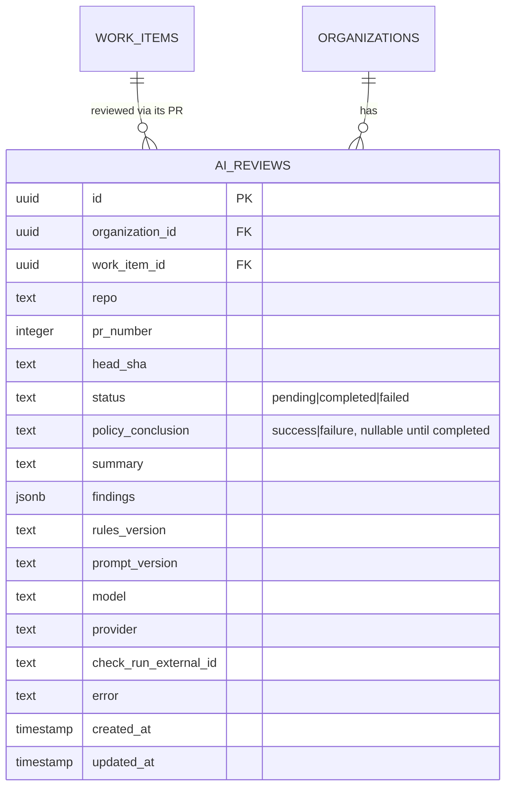

# Wave 4 — AI: architecture & design

**Status:** Draft — for review before implementation
**Scope source:** [`phase-1.md`](../../../phase-1.md) §7 · [`project.md`](../../../project.md) §3, §9, §11
**Modules covered:** Ticket AI (generation/improvement), the AI Review Pipeline (diff → analyze → findings → GitHub check), and AI-review-as-merge-gate. `packages/ai` itself (the `AiProvider` port + `review/` layer) is **out of scope for redesign here** — its contract is already specified in [`packages/ai/README.md`](../../../packages/ai/README.md) (frozen doc, not yet implemented); this wave consumes that contract and implements one vendor adapter against it.

> **Done when** (from `phase-1.md`): opening a PR posts a pending check, the
> AI review completes and updates the check (failure only on `critical`),
> findings appear in GitHub and the platform, and merge is blocked by branch
> protection until the check resolves. Ticket AI: a ticket can be created
> with AI assistance (generation/improvement/acceptance criteria).

This doc is the low-level design for that slice. Read `project.md` §9's "AI
review gating (deterministic)" diagram and §3 principle 7 ("AI recommends,
policy decides") first; this is the level below, and the level above
`packages/ai/README.md` (which owns the provider/review contract this wave
calls into, not reinvents).

---

## 1. Scope for this wave

Wave 3 gave every work item a bound PR (`pr_ref`) and a reconciled lifecycle.
Wave 4 adds the platform's AI surface on top of that: assisting ticket
authorship, and gating merges with an automated code review whose
**conclusion is enforced by GitHub, not by DevFlow** (`project.md` §3.8
"gates enforced at the source").

In scope:

- **One `packages/ai` vendor adapter** implementing the already-frozen
  `AiProvider` port + `review/` layer (README's own scope: "implementation
  ... follows, starting with one adapter"). Picking and building it is this
  wave's first step, not a redesign of the port.
- **`modules/ticket-ai`** — `generateTicketDraft` (title + description +
  acceptance criteria from a short prompt) and `improveTicketDraft` (given
  an existing draft, tighten/expand it). Returns a **draft, not a persisted
  work item** — the existing Wave 3 create-and-bind flow
  (`createAndBindWorkItem`) is the only path that ever writes to Plane or
  `work_items`; Ticket AI never calls `createIssue` itself (design
  consequence of `project.md` §3.7 "AI recommends, policy decides" applied
  to authorship, not just review).
- **`modules/ai-review`** — the AI Review Pipeline: on a new/updated PR
  linked to a work item, fetch the diff, call `reviewCode`, persist the
  result, apply the deterministic policy, and project the conclusion onto a
  GitHub Check (`devflow/ai-review`). Also posts findings as PR comments
  (`createComment`, already on `SourceControlPort`).
- **AI review as merge gate** — pending check on PR open/sync, resolved
  check on completion; policy is "fail on `critical`" by default,
  configurable per project.
- A small, justified **port-model extension**: `PullRequest.headSha` (§3.1)
  — `upsertCheckRun` needs a commit sha and no existing normalized model
  carries one.

Explicitly **out of scope** (flagged, not silently assumed):

| Item                                                                                      | Deferred to                                  | Why                                                                                                                                                               |
| ----------------------------------------------------------------------------------------- | -------------------------------------------- | ----------------------------------------------------------------------------------------------------------------------------------------------------------------- |
| Repository-aware AI / RAG, technical specs, implementation plans, reviewer recommendation | Phase 2 (`project.md` §13)                   | Explicit roadmap phase boundary; this wave's `ReviewCodeInput` takes only the diff + optional project rules, not a repo index.                                    |
| A second `packages/ai` vendor adapter                                                     | Later, if/when needed                        | The port is provider-agnostic by design; MVP ships one adapter, matching Wave 2's "one adapter per category" precedent.                                           |
| Automatic branch-protection configuration on the GitHub repo                              | Manual for MVP (documented), automated later | `phase-1.md` §7 says "offer to set branch protection" — a one-time repo-admin action; automating it via the GitHub API is an enhancement, not blocking done-when. |
| Any UI (ticket generation form, AI review findings view)                                  | Wave 5 (Frontend)                            | This wave is API-only; endpoints are shaped so the UI is purely additive.                                                                                         |
| Cost/budget guardrails (per-org AI spend limits)                                          | Later (recorded deferral)                    | `AiResult` already surfaces `usage`/`model`/`provider` for this; enforcing a limit is a policy layer this wave doesn't build.                                     |
| Re-reviewing on every `synchronize` (new commits) automatically vs. on demand             | Resolved in §5 (not deferred)                | Decided in this doc, not pushed out — see §5.2.                                                                                                                   |

---

## 2. Domain model



One new table: `ai_reviews`. Each row is **one review of one commit** — a
`synchronize` (new push) creates a **new** row rather than mutating the
prior one, so the review history for a PR is a durable, queryable timeline
(`project.md` §9's activity/audit split: this is closer to a durable
per-revision record than a single mutable "current state" field). Unique on
`(organization_id, repo, pr_number, head_sha)` so a redelivered webhook is
idempotent (a second request for the same commit reuses the existing row
rather than re-running the model).

**Ownership recap, extending Wave 3's table (`project.md` §9):**

| Field                                                  | Owner       | Rule                                                                                                                |
| ------------------------------------------------------ | ----------- | ------------------------------------------------------------------------------------------------------------------- |
| `summary`, `findings`, `policy_conclusion`             | **DevFlow** | Authoritative — the GitHub Check is a **projection** of this row, re-derivable at any time (`project.md` §9).       |
| `check_run_external_id`                                | GitHub      | Cached pointer only, same pattern as Wave 3's `pr_ref`.                                                             |
| `model`, `provider`, `rules_version`, `prompt_version` | **DevFlow** | Traceability for "why did this review differ" (per `packages/ai/README.md`'s own note on `ProjectAiRules.version`). |

---

## 3. Port-model extension

### 3.1 `PullRequest.headSha`

`upsertCheckRun` (`SourceControlPort`, already shipped in Wave 2) requires a
`headSha`. No normalized model exposes one today — `PullRequest` carries
`headRef` (a branch name) but not the commit sha GitHub actually checks. This
is the same category of gap Wave 3 found and fixed for `reopened` (§6 of the
Wave 3 doc) — a small, justified port extension, not a redesign:

```ts
export interface PullRequest {
  // ...unchanged...
  headSha: string; // added — required by upsertCheckRun; GitHub's payload always carries pull_request.head.sha
}
```

The GitHub adapter's mapper already receives the raw webhook payload
(`pull_request.head.sha` is always present); this is a mapping addition, not
a new API call. Every existing call site that constructs a `PullRequest`
(webhook normalize, `createPullRequest`, `getPullRequest`,
`findOrCreatePullRequest`) gets the field for free from data already in
hand.

---

## 4. Ticket AI (`modules/ticket-ai`)

### 4.1 Draft, never persisted directly

```ts
interface GenerateTicketDraftInput {
  prompt: string; // short natural-language description from the user
}
interface TicketDraft {
  title: string;
  description: string;
  acceptanceCriteria: string[];
}
```

`generateTicketDraft` and `improveTicketDraft` (same shape, takes an
existing `TicketDraft` + refinement instructions) call
`AiProvider.generateStructuredOutput({ capability: 'ticket-draft', schema,
... })` and return the draft **to the caller**, unpersisted. The client
reviews/edits it, then calls Wave 3's existing
`POST /projects/:projectId/work-items` (unchanged) with the (possibly
edited) title/description — the **one and only** path that writes to Plane.
This keeps "AI recommends, policy decides" literal for authorship too: the
human decides whether the draft becomes a real ticket, not the AI.

### 4.2 No persistence, no domain event

Because nothing is written until the human submits the existing create
endpoint, `generateTicketDraft`/`improveTicketDraft` need no new table, no
domain event, and no job — they are synchronous request/response API calls
that call `AiProvider` directly from the route handler (matching
`packages/ai`'s "consumed by ... a `@devflow/queue` job handler" note for
the **review** pipeline specifically, not for this lower-stakes, interactive
call). A slow/failed AI call surfaces as a normal HTTP error
(502/`AiProviderError`, etc.) — there is no workflow state to protect,
unlike `startWork`.

---

## 5. AI Review Pipeline (`modules/ai-review`)

### 5.1 Trigger

Runs on **any** normalized PR-opened-or-updated event for a PR linked to a
work item — both DevFlow-initiated (`devworkflow.pull_request_opened`, Wave
3 §4) and out-of-band (`sourcecontrol.pull_request.opened`/`.updated`
reconciled by Wave 3 §6.3), so an externally-opened PR against a tracked
branch gets reviewed too, not just DevFlow's own saga output. Both routes
feed the **same** `ai-review.request` job (mirroring Wave 3 §5's "several
event types → one job" pattern), keyed by `(repo, prNumber, headSha)` so a
duplicate trigger (e.g. both `pull_request_opened` and a near-simultaneous
`sourcecontrol.pull_request.opened` reconciliation) collapses to one job via
a deterministic `jobId`.

### 5.2 Re-review policy: on `synchronize`, not indefinitely

A new push (`sourcecontrol.pull_request.updated`, which Wave 3's GitHub
adapter maps `synchronize`/`edited`/`reopened` onto — §6.3) creates a **new**
`ai_reviews` row for the new `head_sha` and re-runs the pipeline
automatically. This is a deliberate resolution (not deferred): re-reviewing
on every push is what makes the GitHub Check meaningful as a merge gate
(project.md §3.8) — a stale check for an old commit would defeat the point.
Cost is bounded by the fact that pushes are human-paced, not automatic
retries.

### 5.3 The pipeline

```mermaid
sequenceDiagram
    participant Relay as outbox relay
    participant Job as ai-review.request job
    participant SC as SourceControlPort
    participant AI as AiProvider (reviewCode)
    participant DB as ai_reviews

    Relay->>Job: pull_request.{opened,updated} (repo, prNumber, headSha)
    Job->>DB: insert pending row (unique on repo+prNumber+headSha)
    Job->>SC: upsertCheckRun(status: in_progress, name: devflow/ai-review)
    Job->>SC: getDiff(repo, prNumber)
    Job->>AI: reviewCode({ diff, projectRules, context })
    AI-->>Job: CodeReviewResult (schema-validated)
    Job->>DB: tx { row.status=completed, summary, findings, policy_conclusion; outbox: ai.review_completed }
    Job->>SC: upsertCheckRun(status: completed, conclusion: from policy)
    Job->>SC: createComment(...) per finding (or one summary comment, §15 Q1)
```

**Idempotency (design mirrors Wave 3 §4.3's find-or-create pattern):** the
unique `(organization_id, repo, pr_number, head_sha)` constraint means a
retried job (crash after the DB insert but before the check posts, or a
redelivered trigger event) reuses the existing row via **insert-or-fetch**
rather than duplicating a review or re-billing the AI call once `status =
completed`. A job that finds an existing `completed` row for the same
`head_sha` short-circuits immediately.

**Failure path:** if `reviewCode` throws (`AiError` subtype, per
`packages/ai`'s normalized hierarchy) after retries are exhausted (queue's
own retry budget — `packages/ai/README.md`'s three-layer retry table
already forbids this package from retrying), the job sets
`ai_reviews.status = 'failed'`, records `error`, and resolves the GitHub
Check to **`neutral`** (not `failure`) — an AI outage must never silently
block every merge in the org; a human reviewer is still the fallback gate.
This is the AI-specific analogue of Wave 3 §4.5's
`workflow_execution_status = FAILED` pattern: a distinct "the automation
broke" signal, not conflated with "the review failed the code."

### 5.4 The deterministic policy

```ts
function policyConclusion(findings: CodeReviewResult['findings']): 'success' | 'failure' {
  return findings.some((f) => f.severity === 'critical') ? 'failure' : 'success';
}
```

Matches `phase-1.md` §7 literally: "failure only on `critical`" is the MVP
default. `findings` with `high`/`medium`/`low` never fail the check on their
own — they're still posted as comments (visible, actionable) but don't block
merge. This one function is the **entire** enforcement boundary
(`project.md` §3.7 "a raw model score never decides a merge") — everything
upstream of it (the AI call, the schema) only ever produces data.

---

## 6. New database table

```ts
// ai_reviews
{
  id: uuid pk defaultRandom,
  organizationId: uuid → organizations (cascade),
  workItemId: uuid → work_items (cascade),
  repo: text,
  prNumber: integer,
  headSha: text,
  status: text $type<'pending' | 'completed' | 'failed'> default 'pending',
  policyConclusion: text $type<'success' | 'failure'> nullable,
  summary: text nullable,
  findings: jsonb nullable,          // CodeReviewResult['findings'], stored as-is
  rulesVersion: text nullable,       // ProjectAiRules.version, if project rules were supplied
  promptVersion: text,               // this pipeline's own prompt-template version
  model: text nullable,              // from AiResult — the resolved model actually used
  provider: text nullable,           // from AiResult
  checkRunExternalId: text nullable,
  error: text nullable,
  createdAt, updatedAt: timestamptz,
}
// unique (organizationId, repo, prNumber, headSha)
// index (organizationId, workItemId, createdAt)
```

Follows the existing conventions exactly (`uuid` PK `defaultRandom()`,
`organization_id` FK `onDelete: cascade`, `withTimezone` timestamps,
`jsonb` for structured/variable-shape data). Migration generated with
`pnpm --filter @devflow/database db:generate`, reviewed, committed.

---

## 7. Domain events emitted

| Event                 | Emitted when                           | Key payload                                                               |
| --------------------- | -------------------------------------- | ------------------------------------------------------------------------- |
| `ai.review_requested` | pipeline starts (pending row inserted) | `{ workItemId, repo, prNumber, headSha }`                                 |
| `ai.review_completed` | policy conclusion computed             | `{ workItemId, repo, prNumber, headSha, policyConclusion, findingCount }` |
| `ai.review_failed`    | the AI call ultimately failed          | `{ workItemId, repo, prNumber, headSha, error }`                          |

Routed onto the **existing** Wave 3 activity projector (extends
`ACTIVITY_EVENT_TYPES`, §7 of the Wave 3 design) so "AI review completed"
appears on the timeline (`project.md` §9's own example line), and onto the
**existing** notify-slack consumer's event set if the org wants a Slack
line for review completion (extends `NOTIFIED_EVENT_TYPES`, Wave 3 step 7)
— both are additive changes to already-built route lists, not new
infrastructure.

---

## 8. API surface

| Method + path                                                                     | Purpose                                                                        | RBAC       |
| --------------------------------------------------------------------------------- | ------------------------------------------------------------------------------ | ---------- |
| `POST /organizations/:organizationId/projects/:projectId/work-items/draft`        | Ticket AI: generate a draft (unpersisted)                                      | Developer+ |
| `POST /organizations/:organizationId/work-items/draft/improve`                    | Ticket AI: improve an existing draft (unpersisted)                             | Developer+ |
| `GET /organizations/:organizationId/work-items/:workItemId/ai-reviews`            | List AI review rows for a work item's PR history                               | Viewer+    |
| `POST /organizations/:organizationId/work-items/:workItemId/ai-reviews/:id/rerun` | Manually re-run a review for the same commit (e.g. after fixing project rules) | Developer+ |

`draft`/`draft/improve` return `200` synchronously with the `TicketDraft`
shape (§4.1) — no `201`, nothing persisted. The `ai-reviews` list/detail
endpoints exist so Wave 5's frontend has something to render; the pipeline
itself has no other new HTTP surface (it rides the existing
`/api/v1/webhooks/:provider` route → outbox → the new routes, same pattern
as every Wave 3 reconciliation path).

---

## 9. Module & package layout

```text
packages/ai/                         # contract already frozen (README) — implement 1 adapter this wave
├── src/providers/<vendor>/          # NEW this wave — wire-format translation only

apps/api/src/modules/
├── ticket-ai/
│   └── routes/... (draft, draft/improve — thin, calls @devflow/ai directly)
└── ai-review/
    ├── dal/ai-reviews.dal.ts        # org-scoped create/find/list, unique-constraint insert-or-fetch
    ├── service/ai-review.service.ts # orchestrates fetch-diff -> reviewCode -> persist -> policy -> check
    ├── jobs/ai-review-request.job.ts
    ├── events.ts                    # ai.review_requested / _completed / _failed
    ├── routing.ts                   # pull_request.{opened,updated} (both origins) -> ai-review-request job
    └── routes/... (list, rerun)
```

New env vars: whichever the chosen vendor adapter needs (e.g.
`ANTHROPIC_API_KEY` or `OPENAI_API_KEY`) plus a capability→model mapping
(`packages/ai/README.md`'s "Model selection" section) — added across the
same four places as every prior wave (`env.ts`, `.env`/`.env.example`,
`turbo.json`, `ci.yml`).

---

## 10. Security & correctness notes

- **Untrusted content boundary is structural, not a convention** (`project.md`
  §9, §11, `packages/ai/README.md`'s own non-goal list): the diff is passed
  as `ReviewCodeInput.diff`, never concatenated into a system/developer
  instruction string by this wave's code — `review/prompts.ts` (inside
  `packages/ai`, already designed) owns that delimiting.
- **Policy is the only enforcement point** (§5.4) — nothing upstream (the
  provider call, the schema validation) can independently pass/fail a PR.
- **Idempotent by commit** — the `(repo, prNumber, headSha)` unique
  constraint means retries/redeliveries never re-bill the AI provider for
  the same commit once a row is `completed`.
- **RBAC + org-scoping** unchanged from Wave 1/3 patterns — `ai_reviews` is
  looked up through the same org-scoped DAL convention as `work_items`.
- **Cost visibility, not cost enforcement** (flagged out-of-scope, §1) —
  `model`/`provider` are stored per review specifically so a future budget
  policy has data to act on without a schema change.
- **An AI outage degrades to `neutral`, never to `failure` or to silently
  skipping the check** (§5.3) — matches `project.md` §3.7's "AI recommends"
  framing: the absence of an opinion is not itself a rejection.

---

## 11. Build sequence (suggested PR slicing)

1. **`packages/ai` vendor adapter** — implement the frozen `AiProvider` +
   `review/` contract against one vendor (see §15 Q1 for which). Contract
   tests against the README's own shape (`AiResult`, the `AiError`
   hierarchy, the structured-output repair-once semantics).
2. **Port extension** — `PullRequest.headSha` across the model, the GitHub
   mapper, and every adapter/contract-test call site (small, mechanical,
   mirrors Wave 3's `reopened` fix).
3. **`ai_reviews` table + DAL + AI Review Pipeline** — the job, the trigger
   routes (both PR origins → one job), the policy function, the GitHub
   Check lifecycle (pending → resolved), findings-as-comments. This is the
   done-when-bearing step.
4. **Route registry additions** — extend Wave 3's activity `ACTIVITY_EVENT_TYPES`
   and notify-slack's `NOTIFIED_EVENT_TYPES` with the three `ai.review_*`
   events (additive, no new infrastructure).
5. **Ticket AI** — the two draft endpoints, thin routes calling
   `@devflow/ai` directly.
6. **`ai-reviews` list/rerun endpoints** — for Wave 5 to build against.

---

## 12. Testing focus (Wave 4)

- **Vendor adapter contract tests**: matches every shape in
  `packages/ai/README.md` — `AiResult` fields present, the full `AiError`
  hierarchy mapped, the structured-output repair-once-then-`AiValidationError`
  semantics, `AiProviderConfigurationError` for an unmapped capability.
- **Policy function**: exhaustive — any `critical` finding → `failure`;
  only `high`/`medium`/`low`/no findings → `success`.
- **Idempotency**: two triggers for the same `(repo, prNumber, headSha)`
  (e.g. both PR origins firing near-simultaneously) produce **one**
  `ai_reviews` row and **one** AI provider call, not two.
- **Re-review on push**: a `synchronize` for a new `headSha` creates a new
  row and re-runs the pipeline; the old row for the previous `headSha` is
  untouched (immutable history).
- **AI failure degrades correctly**: a simulated `AiProviderError` (post
  queue-retry-exhaustion) results in `status = 'failed'`, a `neutral`
  check conclusion, and an `ai.review_failed` event — never `failure`,
  never a silently missing check.
- **Ticket AI drafts are never persisted**: `generateTicketDraft` /
  `improveTicketDraft` produce no `work_items` row and no domain event on
  their own.
- **Untrusted-content non-goal check** (construction-level, mirrors Wave 3's
  "no code path calls updateIssue" test pattern): no code path in
  `modules/ai-review` concatenates diff content into anything treated as an
  instruction — asserted by the request shape (`ReviewCodeInput`), not by a
  runtime check.

---

## 13. Open questions for review

1. **Which vendor ships first?** `packages/ai/README.md` names
   OpenAI/Anthropic as examples without picking one. Proposal: **Anthropic**
   (Claude), matching the team's existing tool usage and this
   session's own conventions. Confirm, or specify a different vendor.
2. **Findings as PR comments: one summary comment, or one comment per
   finding?** §5.3 leaves this open. Proposal: **one summary comment** listing
   all findings (grouped by severity) rather than N separate comments —
   simpler to update/replace on re-review (edit-or-replace one comment vs.
   reconciling N). Confirm, or prefer per-finding inline comments (closer to
   a human reviewer's UX, but needs a dedupe/update strategy per Wave 2 §3.7
   tier-2 idempotency for each comment).
3. **`promptVersion` source of truth.** Proposed as a literal string bumped
   by hand in `modules/ai-review` whenever the review request shape/
   instructions change meaningfully (mirrors `ProjectAiRules.version`'s
   manual-bump precedent already established in `packages/ai`). Confirm
   this lightweight approach is acceptable for MVP.
4. **`GET /ai-reviews` pagination/limit** — should mirror Wave 3's
   `listActivity` pattern (`limit`/`offset`, capped at 200)? Proposing yes,
   for consistency; flagging since it's a small, easy-to-miss detail.
5. **Manual rerun endpoint's relationship to the unique constraint.** Since
   `(repo, prNumber, headSha)` is unique, a "rerun" for the same commit
   can't insert a new row. Proposal: rerun **updates the existing row**
   back to `pending` and re-triggers the job (not a new row) — this is the
   one legitimate mutation of an otherwise-immutable-per-commit row.
   Confirm, or prefer minting a new row with a synthetic revision suffix
   (more complex, preserves prior attempt history).
6. **Where does `projectRules` (`ProjectAiRules`) come from for MVP?** Not
   yet modeled anywhere in `WorkflowConfig` or elsewhere. Proposal: **defer
   to Phase 2** (project-specific AI review rules as a configurable field)
   and call `reviewCode` with `projectRules: undefined` for MVP — every
   project gets the same baseline review instructions. Confirm this is an
   acceptable MVP simplification, not a silent gap.

---

## 14. Design-review resolution log

_(to be filled after the first review pass, mirroring Wave 2 §16 / Wave 3 §16)_
